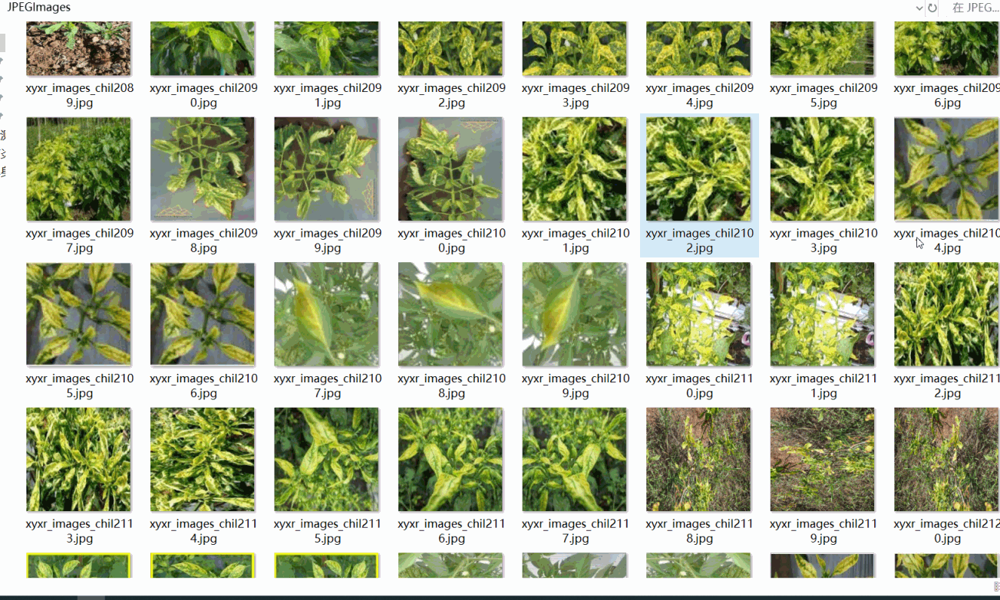
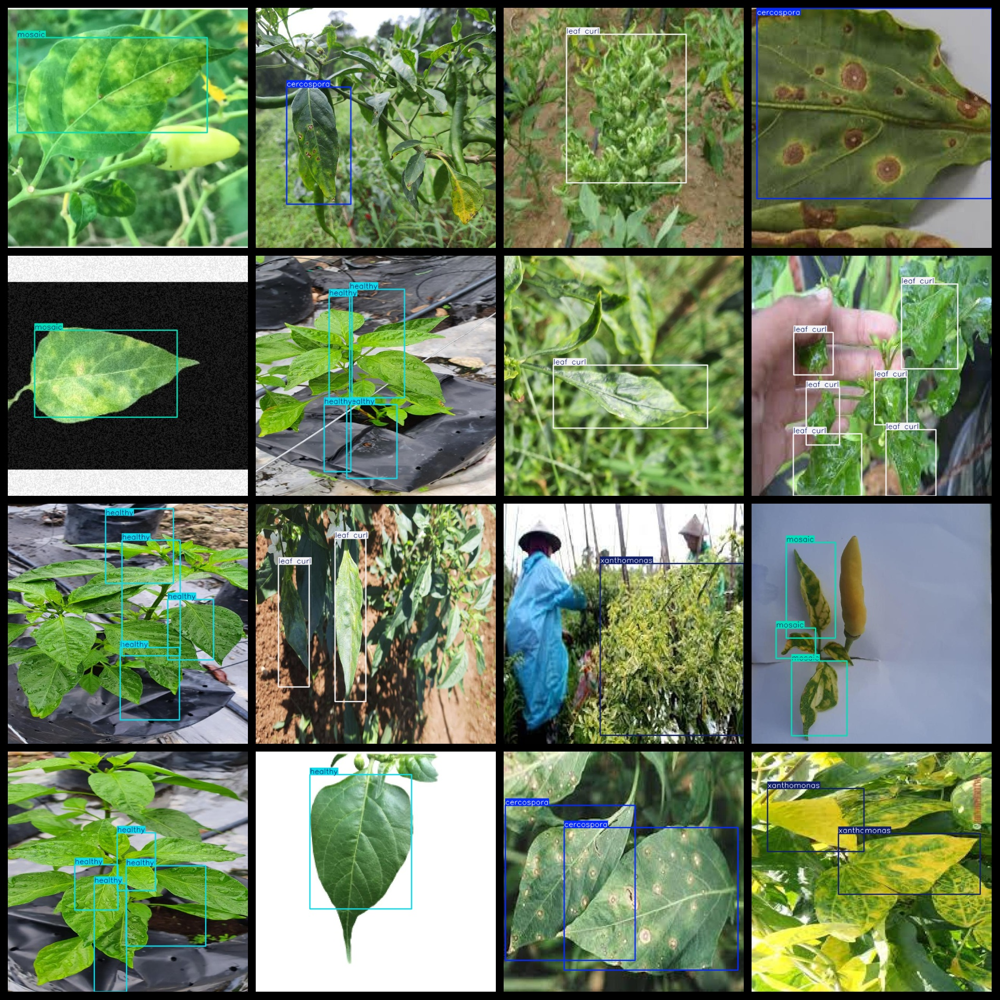

# [Object Detection] Pepper Leaf Disease Detection Dataset

The dataset format is VOC format + YOLO format.

The zip file contains three folders, each storing images, XML files, and text files.

In the JPEGImages folder, there are a total of 2258 JPEG images.

In the Annotations folder, there are a total of 2258 XML files.

In the labels folder, there are a total of 2258 text files.

There are a total of 5 types of labels: ["cercospora", "healthy", "leaf curl", "mosaic", "xanthomonas"].

The number of boxes for each label (note that the order of categories in the YOLO format does not correspond to this, but rather to the classes.txt in the labels folder):

Cercospora  boxes = 818 (Cercospora)

Healthy  boxes = 567 (Healthy)

Leaf curl  boxes = 1849 (Leaf curl)

Mosaic  boxes = 388 (Mosaic)

Xanthomonas  boxes = 1025 (Xanthomonas)

Total boxes = 4647

The image clarity (resolution: pixels): Clear

The images have not been enhanced.

The shape of the labels: Rectangular boxes, used for target detection recognition.

Important Note: There is no guarantee from this dataset about the accuracy or weights of the trained model. The dataset only provides accurate and reasonable annotations.

## Images

---

Here is a pay link on Stripe (https://buy.stripe.com/3cs8yP7sY87d0vu9AB). Please contact me lonlonago@foxmail.com after funding $89, and I will send you a complete data files, thank you!

